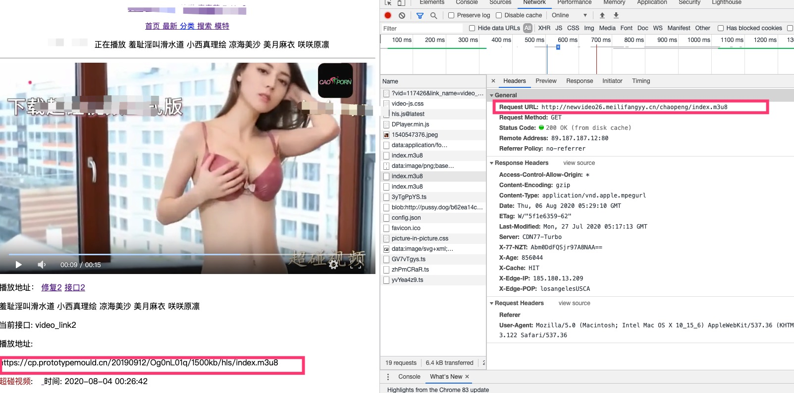
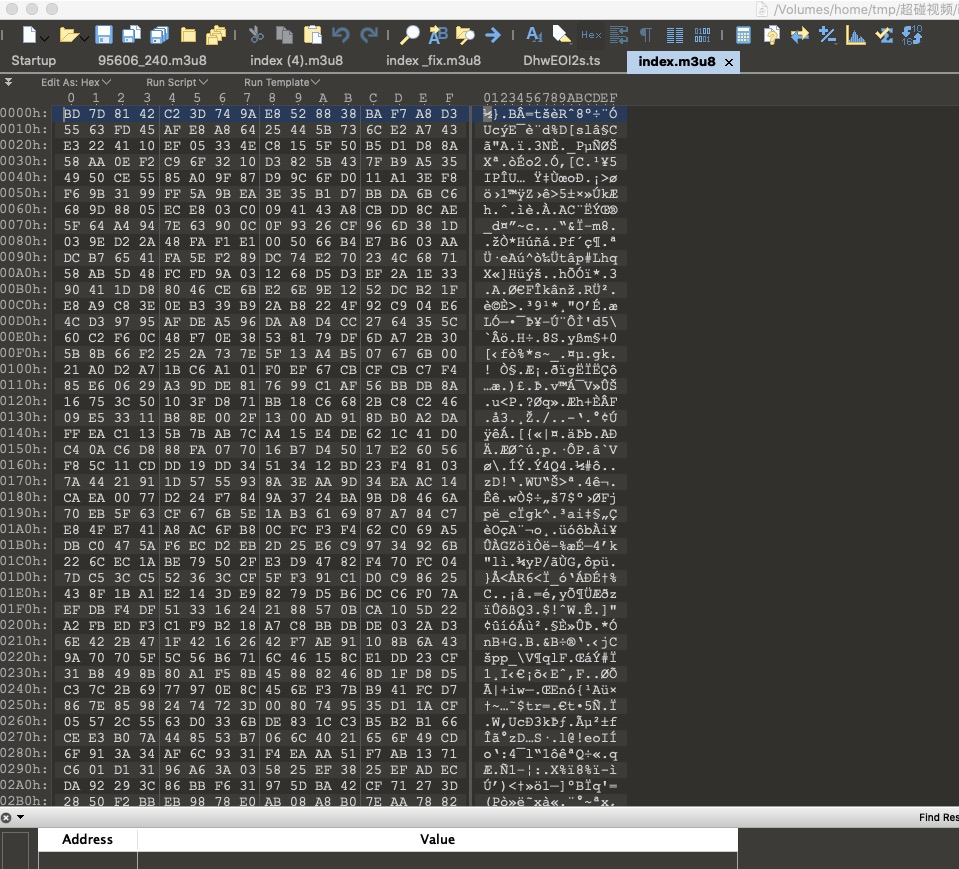
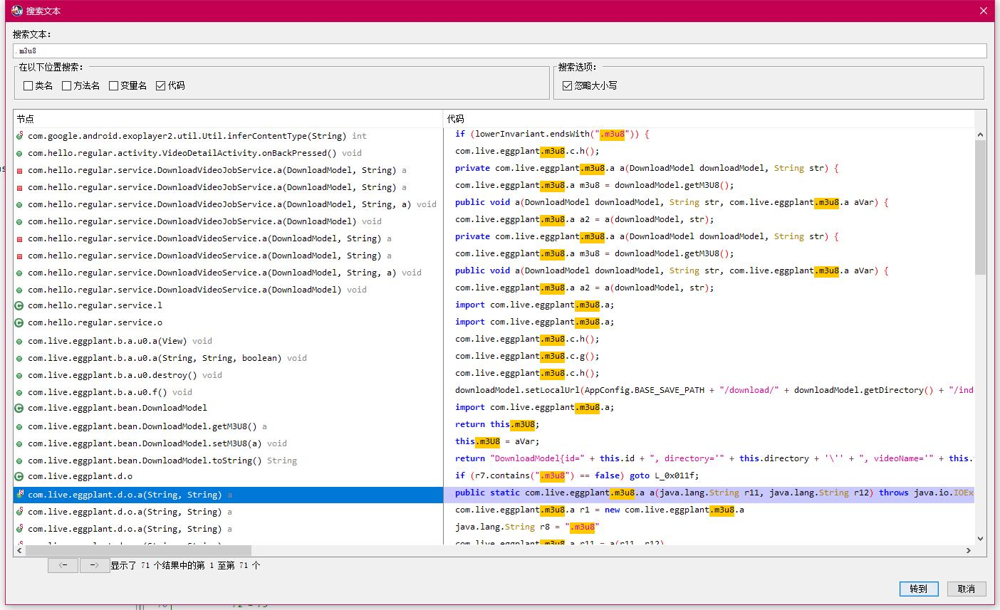
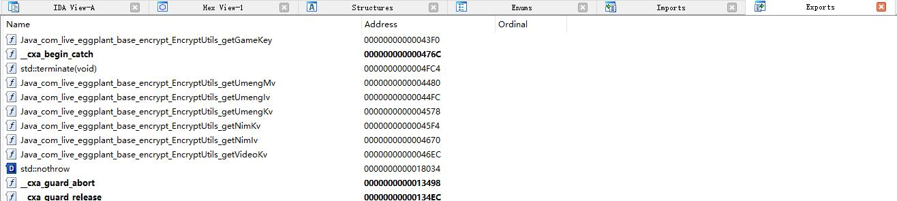
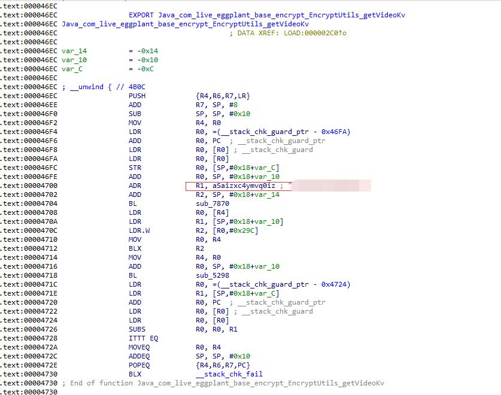
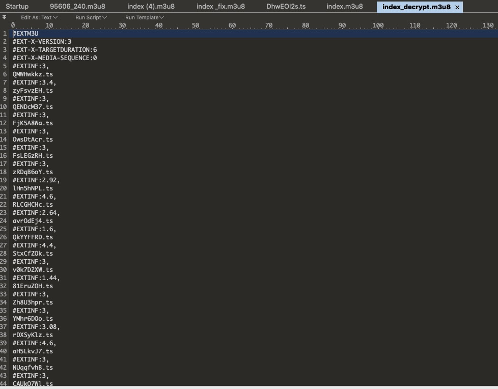
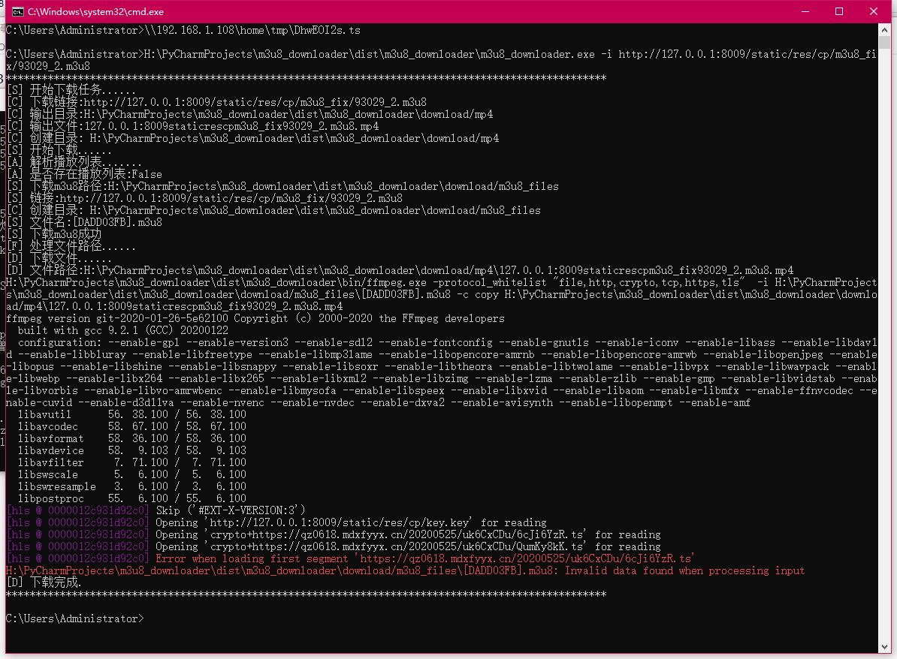
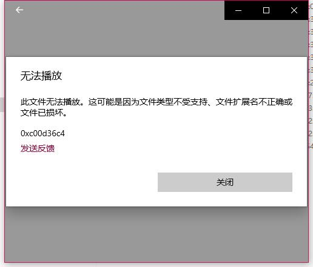

###攻城略地 再下一Porn

----
查看爬取的数据的时候，突然发现一个网站的视频不能播放了，所有的视频在播放的时候都会显示下载正式版。  
  
这尼玛当时就尴尬了，访问播放地址就会发现，重定向到另外一个域名了。  
  
其实不单纯是播放地址替换掉了，如果是旧版本的app同样会提示下载新版，旧版将无法正常播放。  
  
直接对app进行抓包，抓包之后虽然能够获取m3u8地址，但是下载下载就会发现文件已经被加密了，并不是正常的播放列表。  
  
(如何抓包，请参考：http://h4ck.org.cn/2020/07/某加密到牙齿的app数据加密分析/)  
根据apk文件名大概猜测，可能被加固了，那么首先就要进行脱壳（如果不确定可以找个查壳工具看一下。）  
使用反射大师进行脱壳，脱壳之前需要安装xposed。具体可以参考这个链接：https://blog.csdn.net/qq_41855420/article/details/106276824
不过需要注意的是，如果是使用夜神模拟器，不要使用文章中的xposed安装器，从下面的链接下载apk进行安装。
https://forum.xda-developers.com/showthread.php?t=3034811  
其余的工具安装和脱壳，按照文章中的方法进行操作即可。  
脱壳流程：  
  
脱壳之后就可以使用jadx进行分析了，将脱壳之后的class.dex进行分析。
通过搜索m3u8可以定位到如下的代码：  
  
主要代码如下：  
```javascript
public static com.live.eggplant.m3u8.a a(java.lang.String r11, java.lang.String r12) throws java.io.IOException {
        /*
            java.net.URL r0 = new java.net.URL
            r0.<init>(r11)
            java.net.URLConnection r11 = r0.openConnection()
            java.net.HttpURLConnection r11 = (java.net.HttpURLConnection) r11
            com.hello.regular.App r0 = com.hello.regular.App.k()
            java.lang.String r0 = com.live.eggplant.base.HttpClient.getBaseUrl(r0)
            java.net.URI r0 = java.net.URI.create(r0)
            java.lang.StringBuilder r1 = new java.lang.StringBuilder
            r1.<init>()
            java.lang.String r2 = r0.getScheme()
            r1.append(r2)
            java.lang.String r2 = "://"
            r1.append(r2)
            java.lang.String r0 = r0.getHost()
            r1.append(r0)
            java.lang.String r0 = "/"
            r1.append(r0)
            java.lang.String r1 = r1.toString()
            java.lang.String r2 = "Referer"
            r11.setRequestProperty(r2, r1)
            int r1 = r11.getResponseCode()
            java.lang.String r2 = ""
            r3 = 200(0xc8, float:2.8E-43)
            if (r1 != r3) goto L_0x0152
            java.net.URL r1 = r11.getURL()
            java.lang.String r1 = r1.toString()
            int r0 = r1.lastIndexOf(r0)
            int r0 = r0 + 1
            r3 = 0
            java.lang.String r0 = r1.substring(r3, r0)
            com.live.eggplant.m3u8.a r1 = new com.live.eggplant.m3u8.a
            r1.<init>()
            r1.a((java.lang.String) r0)
            java.lang.String r4 = com.live.eggplant.base.encrypt.EncryptUtils.getVideoKv()
            java.lang.String r4 = f.a.a.a.a(r4)
            java.io.InputStream r11 = r11.getInputStream()
            byte[] r11 = com.live.eggplant.d.u.a((java.io.InputStream) r11)
            byte[] r11 = com.live.eggplant.base.encrypt.AESUtils.decryptByte(r4, r11)     // Catch:{ Exception -> 0x007d }
            java.lang.String r5 = new java.lang.String     // Catch:{ Exception -> 0x007d }
            r5.<init>(r11)     // Catch:{ Exception -> 0x007d }
            r2 = r5
            goto L_0x0081
        L_0x007d:
            r11 = move-exception
            r11.printStackTrace()
        L_0x0081:
            java.io.BufferedReader r11 = new java.io.BufferedReader
            java.io.StringReader r5 = new java.io.StringReader
            r5.<init>(r2)
            r11.<init>(r5)
            java.lang.StringBuilder r2 = new java.lang.StringBuilder
            r2.<init>()
            r5 = 0
        L_0x0091:
            r6 = 0
        L_0x0092:
            java.lang.String r7 = r11.readLine()
            if (r7 == 0) goto L_0x0129
            java.lang.String r8 = "#"
            boolean r8 = r7.startsWith(r8)
            java.lang.String r9 = "\n"
            if (r8 == 0) goto L_0x00f6
            java.lang.String r8 = "#EXTINF:"
            boolean r8 = r7.startsWith(r8)
            if (r8 == 0) goto L_0x00cd
            r2.append(r7)
            r2.append(r9)
            r6 = 8
            java.lang.String r6 = r7.substring(r6)
            java.lang.String r7 = ","
            boolean r7 = r6.endsWith(r7)
            if (r7 == 0) goto L_0x00c8
            int r7 = r6.length()
            int r7 = r7 + -1
            java.lang.String r6 = r6.substring(r3, r7)
        L_0x00c8:
            float r6 = java.lang.Float.parseFloat(r6)
            goto L_0x0092
        L_0x00cd:
            java.lang.String r8 = "#EXT-X-KEY"
            boolean r8 = r7.startsWith(r8)
            if (r8 == 0) goto L_0x00ef
            java.lang.String r8 = b(r7)
            r1.b(r8)
            java.lang.StringBuilder r10 = new java.lang.StringBuilder
            r10.<init>()
            r10.append(r12)
            r10.append(r8)
            java.lang.String r10 = r10.toString()
            java.lang.String r7 = r7.replace(r8, r10)
        L_0x00ef:
            r2.append(r7)
            r2.append(r9)
            goto L_0x0092
        L_0x00f6:
            r2.append(r12)
            java.lang.String r8 = a(r7)
            r2.append(r8)
            r2.append(r9)
            java.lang.String r8 = ".m3u8"
            boolean r8 = r7.contains(r8)
            if (r8 == 0) goto L_0x011f
            java.lang.StringBuilder r11 = new java.lang.StringBuilder
            r11.<init>()
            r11.append(r0)
            r11.append(r7)
            java.lang.String r11 = r11.toString()
            com.live.eggplant.m3u8.a r11 = a(r11, r12)
            return r11
        L_0x011f:
            com.live.eggplant.m3u8.b r8 = new com.live.eggplant.m3u8.b
            r8.<init>(r7, r6)
            r1.a((com.live.eggplant.m3u8.b) r8)
            goto L_0x0091
        L_0x0129:
            r11.close()
            java.lang.String r11 = r2.toString()     // Catch:{ Exception -> 0x014d }
            byte[] r11 = r11.getBytes()     // Catch:{ Exception -> 0x014d }
            byte[] r11 = com.live.eggplant.base.encrypt.AESUtils.encryptByte(r4, r11)     // Catch:{ Exception -> 0x014d }
            java.lang.StringBuilder r0 = new java.lang.StringBuilder     // Catch:{ Exception -> 0x014d }
            r0.<init>()     // Catch:{ Exception -> 0x014d }
            r0.append(r12)     // Catch:{ Exception -> 0x014d }
            java.lang.String r12 = "index.m3u8"
            r0.append(r12)     // Catch:{ Exception -> 0x014d }
            java.lang.String r12 = r0.toString()     // Catch:{ Exception -> 0x014d }
            com.live.eggplant.base.helper.FileHelper.write((java.lang.String) r12, (byte[]) r11)     // Catch:{ Exception -> 0x014d }
            goto L_0x0151
        L_0x014d:
            r11 = move-exception
            r11.printStackTrace()
        L_0x0151:
            return r1
        L_0x0152:
            java.lang.StringBuilder r12 = new java.lang.StringBuilder
            r12.<init>()
            int r11 = r11.getResponseCode()
            r12.append(r11)
            r12.append(r2)
            r12.toString()
            r11 = 0
            return r11
        */
        throw new UnsupportedOperationException("Method not decompiled: com.live.eggplant.d.o.a(java.lang.String, java.lang.String):com.live.eggplant.m3u8.a");
    }
```
注意到下面的关键代码：  
```javascript
            com.live.eggplant.m3u8.a r1 = new com.live.eggplant.m3u8.a
            r1.<init>()
            r1.a((java.lang.String) r0)
            java.lang.String r4 = com.live.eggplant.base.encrypt.EncryptUtils.getVideoKv()
            java.lang.String r4 = f.a.a.a.a(r4)
            java.io.InputStream r11 = r11.getInputStream()
            byte[] r11 = com.live.eggplant.d.u.a((java.io.InputStream) r11)
            byte[] r11 = com.live.eggplant.base.encrypt.AESUtils.decryptByte(r4, r11)     // Catch:{ Exception -> 0x007d }

```  
com.live.eggplant.base.encrypt.AESUtils.decryptByte(r4, r11)函数定义如下：
```javascript
    public static byte[] decryptByte(String str, byte[] bArr) throws Exception {
        SecretKeySpec secretKeySpec = new SecretKeySpec(toKey(decode(str)).getEncoded(), ALGORITHM);
        Security.addProvider(new BouncyCastleProvider());
        Cipher instance = Cipher.getInstance(ALGORITHMECB);
        instance.init(2, secretKeySpec);
        return instance.doFinal(bArr);
    }
```
至此可以断定解密方式为aes ecb模式。那么只需要知道解密的key就可以获取真正的数据了。解密key通过com.live.eggplant.base.encrypt.EncryptUtils.getVideoKv()方法获取，定义如下：
```javascript
package com.live.eggplant.base.encrypt;

import java.io.Serializable;

public class EncryptUtils implements Serializable {
    static {
        System.loadLibrary("encryptLib");
    }

    public static native String getGameKey();

    public static native String getNimIv();

    public static native String getNimKv();

    public static native String getUmengIv();

    public static native String getUmengKv();

    public static native String getUmengMv();

    public static native String getVideoKv();
}
```
可以看到，这是一个jni方法，通过encryptLib导出。使用ida打开对应的so文件。查看导出函数：  
  
定位到函数体，找到对应的key：  
  
有了key之后就可以尝试解析代码了：  
```python
def aes_decrypt_raw(key, data):
    encodebytes = data
    cipher = AES.new(key, AES.MODE_ECB)
    text_decrypted = cipher.decrypt(encodebytes)
    unpad = lambda s: s[0:-s[-1]]
    text_decrypted = unpad(text_decrypted)
    # 去补位
    # text_decrypted = text_decrypted.decode('utf8')
    return text_decrypted

def decode_m3u8():
    f = open(r"H:\PyCharmProjects\porn_site_spider\index.m3u8", 'rb')
    b = f.read()
    f.close()
    de = aes_decrypt_raw('获取的key'.encode('utf-8'), b)
    f = open(r"H:\PyCharmProjects\porn_site_spider\index_decrypt.m3u8", 'wb')
    f.write(de)
    f.close()
```
解密之后的文件内容：  
  
不过这里解析出来的文件之后相对路径，那么要想能够播放，需要在原有的文件基础上进行链接补全，将所有的ts文件路径替换为url路径。如下：   
```bash
#EXTM3U
#EXT-X-VERSION:3
#EXT-X-TARGETDURATION:6
#EXT-X-MEDIA-SEQUENCE:0
#EXTINF:3,
https://qz0618.mdxfyyx.cn/20200525/uk6CxCDu/6cJi6YzR.ts
#EXTINF:3,
https://qz0618.mdxfyyx.cn/20200525/uk6CxCDu/QumKy8kK.ts
#EXTINF:5.36,
https://qz0618.mdxfyyx.cn/20200525/uk6CxCDu/YzOHvErr.ts
#EXTINF:3,
https://qz0618.mdxfyyx.cn/20200525/uk6CxCDu/AluZvkfV.ts
#EXTINF:2.8,
https://qz0618.mdxfyyx.cn/20200525/uk6CxCDu/hA8zPfXv.ts
```
到这里本来以为就万事大吉，可以进行播放了，但是在实际播放的时候会发现一直在加载，使用ffmpeg下载会提示如下错误：  
  
开始以为是ffmpeg下载的问题，直接用播放器播放也无法进行播放：  
  
到这里猜测可能是ts流也进行了加密，通过上面的key同样对ts流进行解码， 解码之后可以正常播放了：  
  
由于加密是采用的aes，而m3u8本身也支持aes加密，尝试将密钥写入key，然后通过uri进行解密：  
```bash
#EXTM3U
#EXT-X-VERSION:3
#EXT-X-TARGETDURATION:6
#EXT-X-MEDIA-SEQUENCE:0
#EXT-X-KEY:METHOD=AES-128,URI="http://127.0.0.1:8009/static/res/cp/key.key"
#EXTINF:3,
https://qz0618.mdxfyyx.cn/20200525/uk6CxCDu/6cJi6YzR.ts
#EXTINF:3,
https://qz0618.mdxfyyx.cn/20200525/uk6CxCDu/QumKy8kK.ts
#EXTINF:5.36,
https://qz0618.mdxfyyx.cn/20200525/uk6CxCDu/YzOHvErr.ts
#EXTINF:3,
https://qz0618.mdxfyyx.cn/20200525/uk6CxCDu/AluZvkfV.ts
#EXTINF:2.8,
https://qz0618.mdxfyyx.cn/20200525/uk6CxCDu/hA8zPfXv.ts
#EXTINF:3,
https://qz0618.mdxfyyx.cn/20200525/uk6CxCDu/CTr9oD45.ts
#EXTINF:3,
```
然而这种方法无效，无法正常进行播放，猜测可能由于aes的加密方式导致的，m3u8文件的aes加密方式为aes-128-cbc 而这里的加密方式为ecb。谁知道如何直接将密钥写入key进行解密，还望不吝赐教。 
既然如此，如果要在线播放就需要在线解密ts流，在服务器上实现个ts代理，将获取到的数据首先进行解密然后返回：  
```python
@csrf_exempt
def ts_proxy(request):
    """
    代理接口
    http://127.0.0.1:8009/cp-ts-proxy/?ts_link=https://qz0618.mdxfyyx.cn/20200525/uk6CxCDu/6cJi6YzR.ts
    """

    ts_link = request.GET.get('ts_link')
    headers = {
        'User-Agent': 'Lavf/57.83.100',
    }  # 替换成自己的cookie

    try:
        r = requests.get(
            ts_link,
            headers=headers)
    except:
        return HttpResponse('', content_type='binary/octet-stream')

    up = urlparse(ts_link)
    file_name = str(up.path).split('/')[-1]

    response = HttpResponse(decode_ts(r.content), content_type='binary/octet-stream')
    content_dis = 'attachment;filename="' + file_name + '"'
    response['Content-Disposition'] = content_dis
    return response

```
此时就可以正常播放了，不过由于服务器带宽，以及在线解密，有时会卡顿  
  

----
- obaby@mars  
- http://www.h4ck.org.cn
- http://www.findu.co
- http://www.obaby.org.cn
----